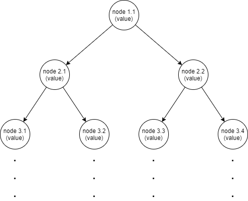

# Big Tree

## Description

The application generates a binary tree. For each node, three steps are performed:

- Calculate node's value
- Generate left child
- Generate right child

Your job is to improve the time for generating the tree.

**Note:** The algorithm that calculates the node's value is implemented by a third-party team and we do not have access to improve it.

## Hint

Find a way to asynchronously calculate the values for each node while the main thread is generating all the nodes.

## Suggestions

As in the previous exercises, implement your solution in new classes that implement the `IJob` interface and add it into the jobs collection from `JobsWorld` class. In this way we can compare the performance of each proposed solution as all of them will be run and displayed in the console.

